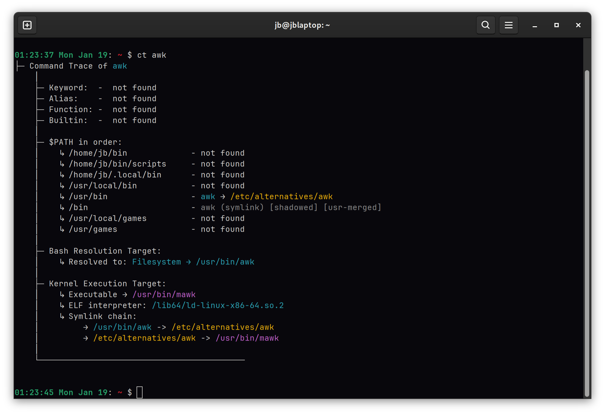
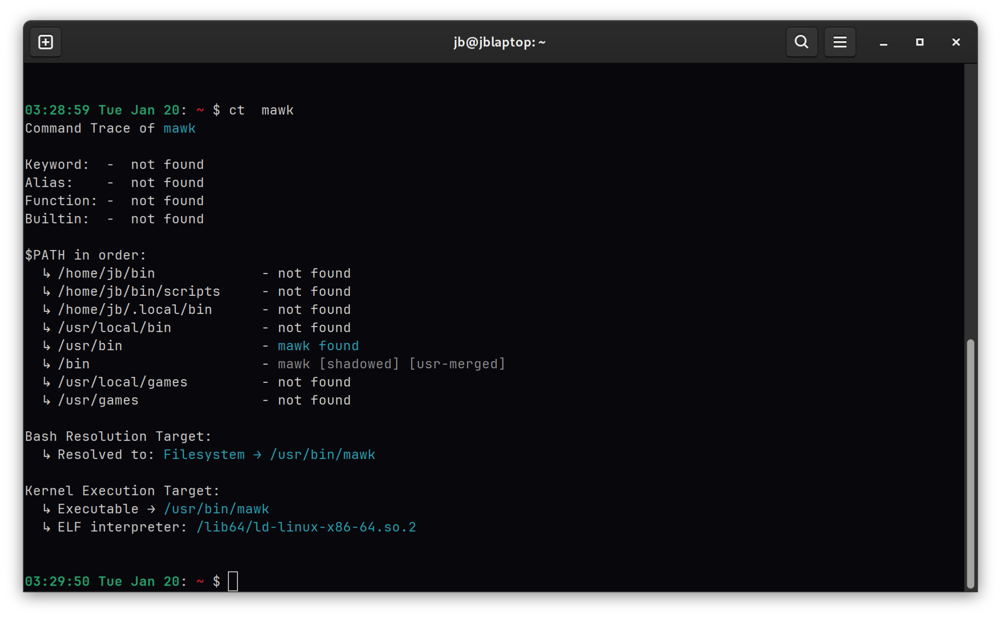
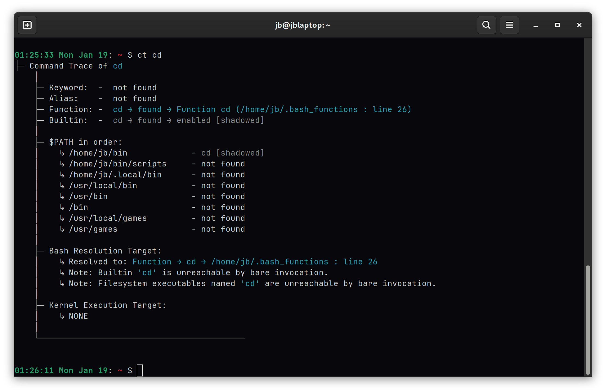
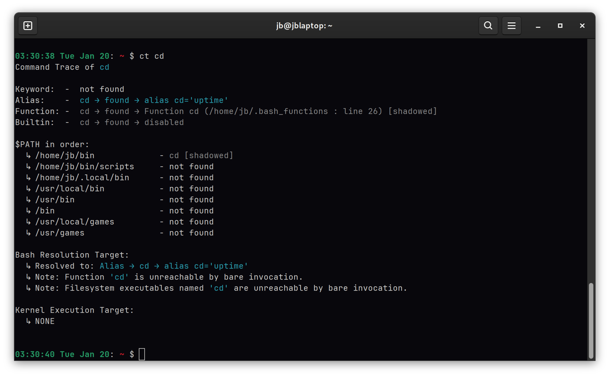
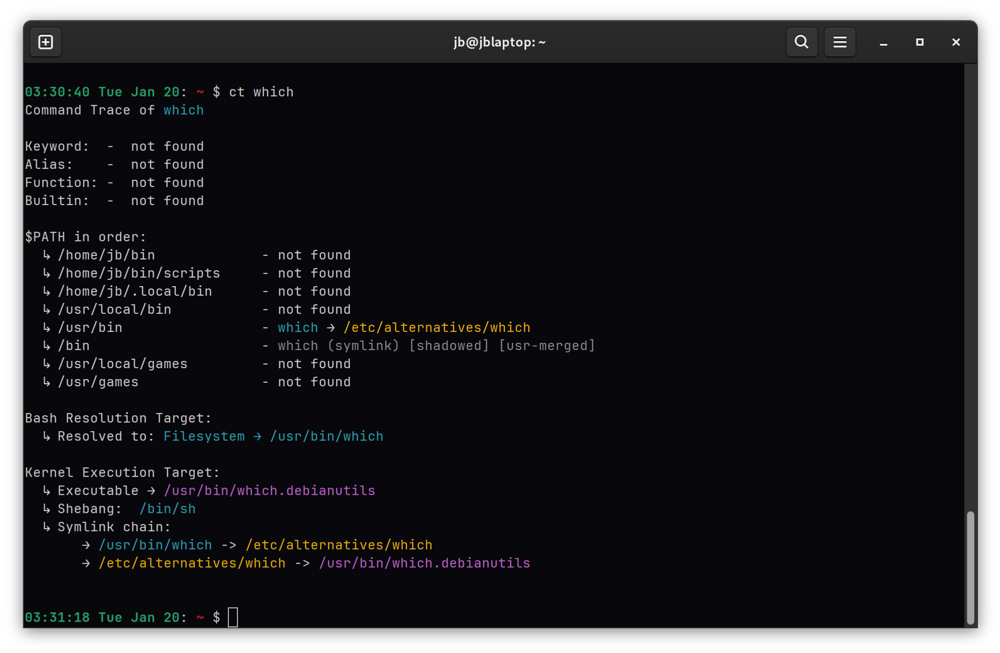

# bash_ct

`ct` (Command Trace) is a Bash command resolution tracer that explains **how Bash resolves a command** and **what the kernel ultimately executes**.

It traces the full resolution process—covering aliases, functions, keywords, builtins, and external executables—while exposing shadowed commands, overrides, and filesystem indirection.

`ct` combines and extends `type`, `which`, `command -v`, and `file`, providing visibility into Bash resolution order, `$PATH` shadowing, and kernel execution details.

---

## What `ct` shows

* Bash resolution order for aliases, functions, keywords, builtins, and executables
* Shadowed commands and overrides (e.g. aliases or functions hiding binaries)
* Full `$PATH` scan, including shadowed or unreachable entries
* Clear separation of **Bash resolution targets** vs **kernel execution targets**
* Filesystem execution details:

  * Canonical executable paths
  * Symlink chains (including `/etc/alternatives`)
  * ELF interpreters for binaries
  * Shebangs for scripts
* Optional JSON output for scripting and automation

`ct` is intended for understanding **why** a command resolves the way it does—not just **what** it resolves to.

---

## Features (Quick Summary)

* Traces Bash command resolution for aliases, functions, keywords, builtins, and executables
* Shows Bash vs kernel execution targets
* Highlights shadowed commands and overrides
* Performs a full `$PATH` scan, including shadowed or unreachable entries
* Detects builtin state (enabled vs disabled)
* Resolves filesystem details: canonical paths, symlink chains, `/etc/alternatives`, ELF interpreters, shebangs
* Safely auto-extends `$PATH` to include admin/system directories
* Supports `-x` / `--extend` for manual path extension
* Handles edge cases: reserved keywords, special characters, shadowed functions
* Produces color-coded, human-readable output
* Optional JSON output for scripting and automation
* Supports tab completion
* Preserves shell environment state
* Compatible with Bash ≥ 4.4 and `/usr`-merged systems
* Works in both interactive shells and scripts

---

## JSON Output

JSON output is intended for scripting and inspection.

### Notes

* Fields may be added in future versions
* Consumers should not assume strict schema stability across major versions
* `null` indicates “not applicable”
* Boolean fields are always `true` or `false`

### PATH Entries

Each PATH entry reports:

* Directory
* State (`notfound`, `file`, `symlink`)
* Symlink target (if applicable)
* Shadowed status
* `/usr`-merge detection

---

## Requirements

**Core dependencies**

* `grep`, `file`, `cut`, `head`, `readlink`, `readelf`, `awk`

**Optional (for color output)**

* `tput`

**Bash version**

* Bash ≥ 4.4

---

## Installation

### 1. Manual Installation

Clone the repository.
```bash
# Clone the repository.
git clone https://github.com/JB63134/bash_ca.git /usr/local/bin/bash_ct

# Source the main script in your .bashrc or .bash_profile
echo "source /usr/local/bin/bash_ct/.bash_ct" >> ~/.bashrc

# Apply changes immediately
source ~/.bashrc
```

---

## Usage

```text
ct [options] command
```

### Options

| Option            | Description              |
| ----------------- | ------------------------ |
| `-h`, `--help`    | Show usage information   |
| `-v`, `--version` | Show version and license |
| `-j`, `--json`    | Emit JSON output         |
| `-x`, `--extend`  | Extend `$PATH` manually  |

---

## Examples

```bash
ct ls
ct python
ct -j bash
```

Invalid (paths are rejected):

```bash
ct /bin/ls
ct ./script
```

---
## Screenshots / Output Preview






