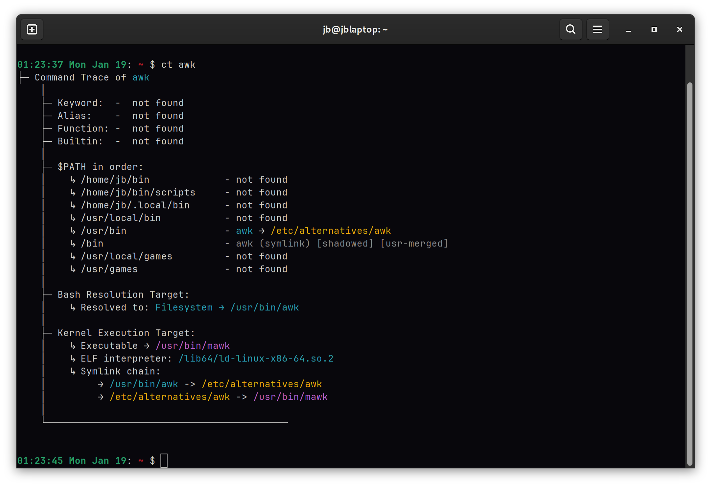
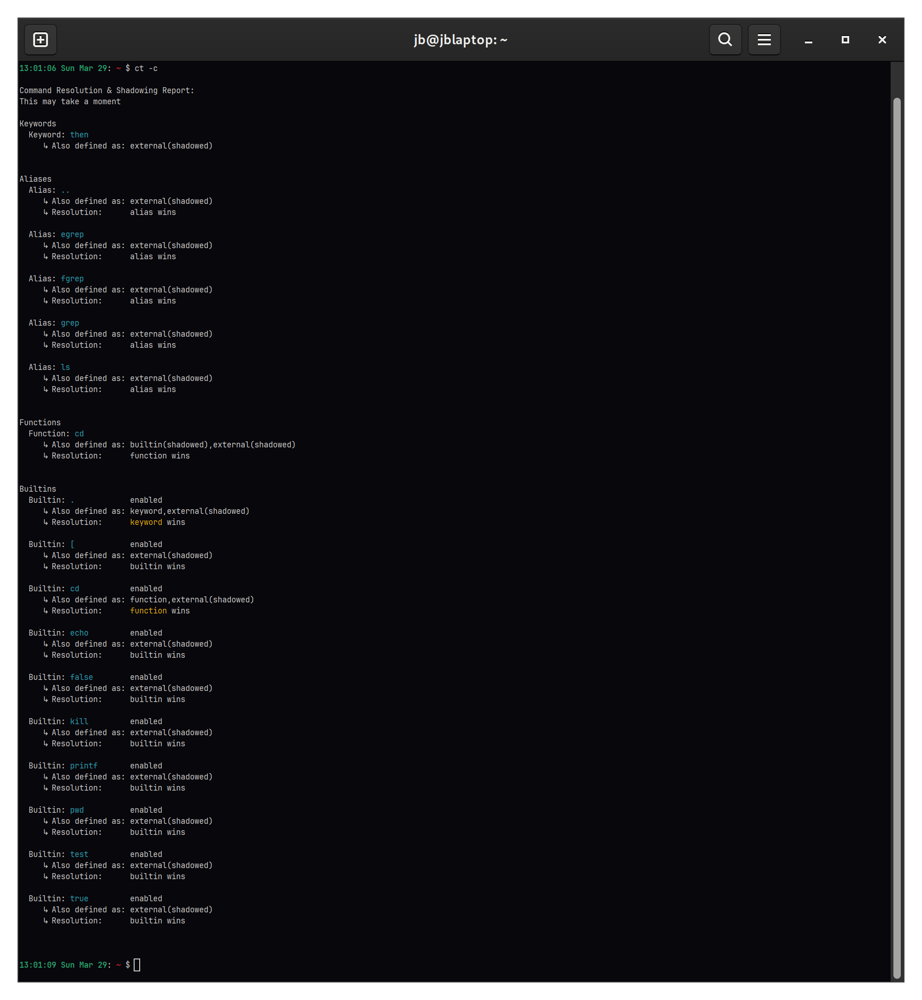
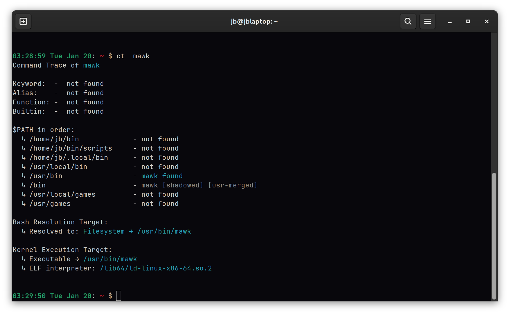
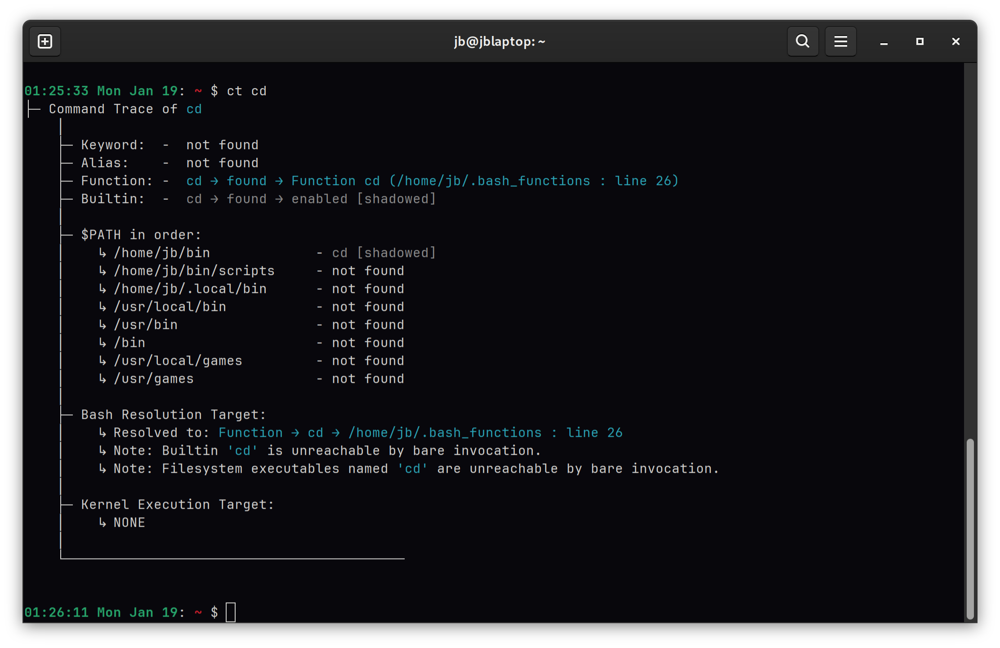
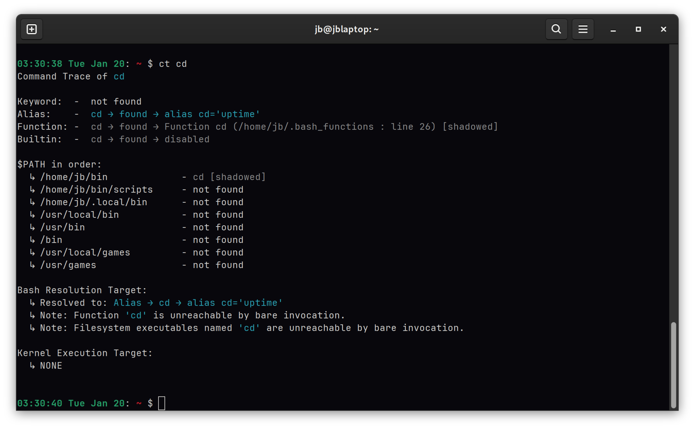
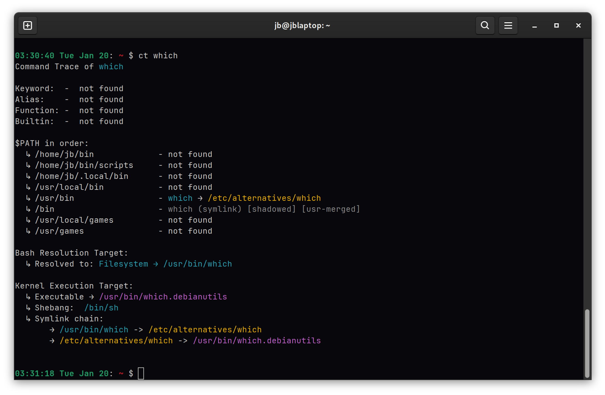

# bash_ct

[](LICENSE)
[](https://github.com/JB63134/bash_ct/releases)

`ct` (Command Trace) is a Bash command analysis tool that explains:

* **how Bash resolves a command**
* **what the kernel ultimately executes**

It provides visibility into shell behavior, including resolution order, shadowing, and filesystem execution details.

---
## Core Concept

`ct` operates in **two distinct modes**:

### 1. Command Trace Mode (default)

```bash
ct <command>
```

Analyzes a single command and reports:

* Bash resolution path (alias, function, keyword, builtin, PATH)
* Full `$PATH` scan (including shadowed and unreachable entries)
* Shadowed commands and overrides
* Kernel execution target (actual executable)
* Filesystem execution details:
  * canonical paths
  * symlink chains (including `/etc/alternatives`)
  * ELF interpreters (for binaries)
  * shebangs (for scripts)

Clear separation of:

* **Bash Resolution Target**
* **Kernel Execution Target**

### 2. Conflict Analysis Mode

```bash
ct -c
```

Scans the current shell environment and reports **command name collisions** across:

* aliases  
* functions  
* builtins  
* keywords  

Also checks whether those names exist as external commands in `$PATH`.

#### Key behavior

* Focuses on **name collisions**, not full resolution tracing  
* External commands are reported only as **presence indicators**  
* Does **not perform a full `$PATH` scan**
  * avoids excessive noise  
  * avoids misleading conflicts caused by PATH precedence  
* Reflects actual **Bash resolution rules**

---
## Features

* Bash command resolution tracing
* Environment-wide conflict detection (`-c`)
* Accurate shadowing detection
* Full `$PATH` visibility (trace mode only)
* Separation of Bash vs kernel execution
* Filesystem introspection:
  * canonical paths
  * symlink chains
  * `/etc/alternatives`
  * ELF interpreter detection
  * shebang parsing
* Builtin state detection (enabled/disabled)
* Automatic and manual `$PATH` extension
* JSON output for scripting (`-j`)
* Colorized human-readable output
* Tab completion support
* Safe environment handling (restores `$PATH`, shell options)
* Bash ≥ 4.4 compatible

---
## JSON Output

JSON mode is intended for scripting and inspection.

```bash
ct -j ls
ct -c --json
```

### Notes

* Fields may change across versions  
* Do not assume strict schema stability  
* `null` = not applicable  
* Booleans are always `true` / `false`  

### Command Trace JSON includes:

* resolution type (`alias`, `function`, `builtin`, `keyword`, `path`)
* PATH scan results
* kernel execution details
* shadowing indicators

### Conflict JSON includes:

* command name
* resolution winner
* alternate definitions
* shadowed status

---
## Requirements

### Core dependencies

* `grep`, `file`, `cut`, `head`, `readlink`, `readelf`, `awk`

### Optional

* `tput` (color output)

### Shell

* Bash ≥ 4.4

---
## Installation

### Manual

```bash
git clone https://github.com/JB63134/bash_ct.git /usr/local/bin/bash_ct

echo "source /usr/local/bin/bash_ct/.bash_ct" >> ~/.bashrc
source ~/.bashrc
```

---
## Usage

```text
ct [options] command
ct -c [options]
```

### Options

| Option             | Description                        |
|------------------|------------------------------------|
| `-h`, `--help`    | Show usage information             |
| `-v`, `--version` | Show version and license           |
| `-j`, `--json`    | Emit JSON output                   |
| `-x`, `--extend`  | Extend `$PATH` for discovery       |
| `-c`, `--conflict`| Run environment conflict analysis  |

---
## Examples

### Command trace

```bash
ct ls
ct python
ct -j bash
```

### Conflict analysis

```bash
ct -c
ct -c --json
```

---
## Behavior Notes

* Commands must be **bare names only**
  * ❌ `/bin/ls`
  * ❌ `./script`
* `$PATH` may be temporarily extended (auto or `-x`)
* Environment is restored after execution

---
## Summary

* `ct <cmd>` → deep resolution + `$PATH` + kernel execution  
* `ct -c` → shell conflict analysis (aliases, functions, builtins, keywords)

This separation keeps output focused and avoids misleading noise from normal `$PATH` behavior.

---
## Screenshots / Output Preview








---


