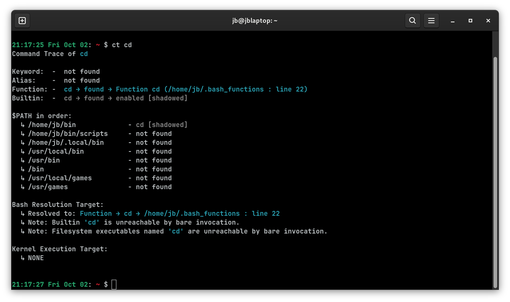
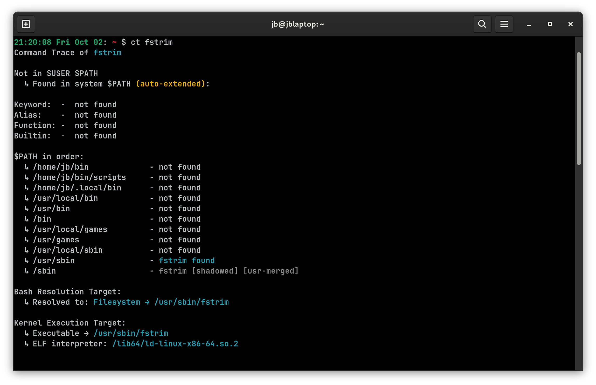
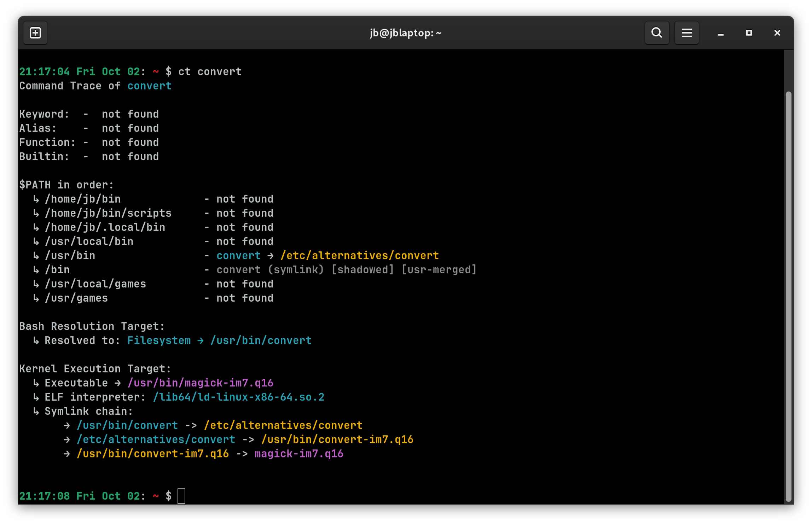
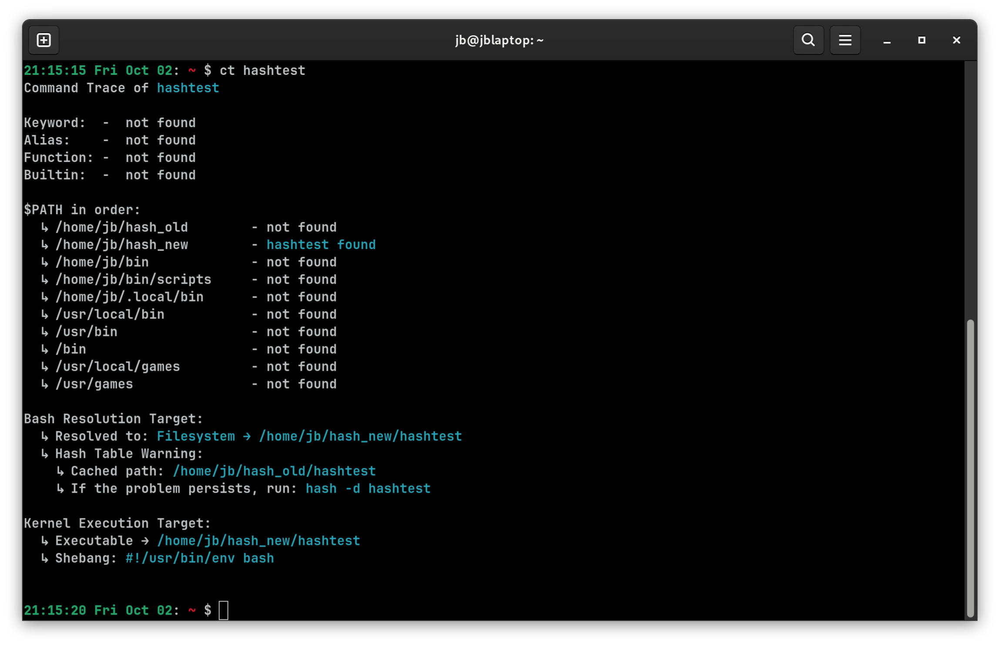
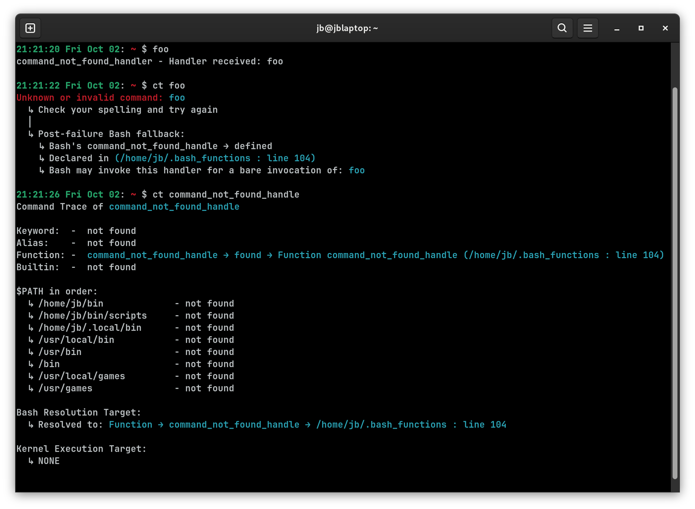

# bash_ct

[](LICENSE)
[](https://github.com/JB63134/bash_ct/releases)

**Bash Command Resolution Trace**

**`ct` (Command Trace) is a Bash command resolution tracer.**

It examines how a command name resolves and traces the subsequent filesystem and execution layers, bringing them together into a single resolution model.

The goal is to answer not only **what command Bash will use**, but **why it resolves that way and what ultimately executes**.

---

## What is Bash command resolution?

When Bash encounters a command name, it does not simply search `$PATH`.

Depending on the command and the current shell environment, Bash may resolve the name as:

1. an alias
2. a function
3. a reserved keyword
4. a builtin
5. an external executable found through `$PATH`

The resolution can also be affected by POSIX mode, disabled builtins, and `$PATH` ordering.

When an external executable is selected, additional filesystem and execution layers can affect what ultimately runs, including symlinks, `/etc/alternatives`, interpreter paths, and system directory layouts.

Traditional tools such as `type`, `which`, and `command -v` answer useful but much narrower questions.

`ct` is intended to answer the broader question:

> **Why does this command resolve the way it does?**

---

## What `ct` shows

For a command such as:

```bash
ct awk
```

`ct` can show:

* aliases
* functions
* reserved keywords
* builtin status
* disabled builtins
* external executables
* `$PATH` entries in search order
* shadowed executables
* canonical filesystem paths
* symlink chains
* `/etc/alternatives` indirection
* `/usr`-merge relationships
* ELF interpreters
* script shebangs
* the Bash resolution target
* the kernel execution target, when applicable

This makes `ct` useful when a command behaves differently from what was expected.

---

## Bash resolution vs. kernel execution

**The Bash resolution target and the kernel execution target are not necessarily the same thing**

For an ELF executable, the path Bash resolves may pass through filesystem indirection before the kernel loads the executable and its ELF interpreter:

```text
Bash Resolution Target
    ↓
/usr/bin/example
    ↓
symlink
    ↓
/usr/bin/example-real
    ↓
ELF interpreter
    ↓
kernel execution
```

For scripts, the execution path can instead involve a shebang:

```text
Bash Resolution Target
    ↓
/usr/local/bin/example
    ↓
#!/usr/bin/env python3
    ↓
interpreter
    ↓
kernel execution
```

`ct` exposes these layers as a whole snapshot of command resolution.

---

## `$PATH` visibility

`ct` examines `$PATH` in order and identifies how those entries affect command visibility.

This includes:

* the first executable Bash can reach
* later shadowed executables
* duplicate or equivalent filesystem locations
* selected system directories that are not currently present in `$PATH`

This is particularly useful when multiple versions of a command exist.

For example:

```bash
ct python
```

can show not only which `python` is selected, but what other candidates exist behind it.

### Automatic path extension

Some system commands exist in administrative directories such as:

```text
/usr/sbin
/sbin
```

These directories may not be present in an ordinary user's `$PATH`.

`ct` can temporarily extend the search path for discovery, allowing it to determine whether an otherwise hidden command exists outside the current `$PATH`.

The shell environment is restored afterward.
 
When ct changes $PATH, Bash discards its remembered command locations, stored in its command hash table. 
Bash lazily rebuilds this table as commands are subsequently executed.

`ct` does not directly modify Bash's command hash table. It does inspect the table to identify cached command paths and detect discrepancies between Bash's cached state and the current $PATH resolution.


### Bash Hash Table (`hash`) Awareness

Bash maintains an internal hash table of remembered command locations to speed up command resolution. `ct` inspects this cached state and compares it against its own live `$PATH` resolution model.

When Bash has a cached path that differs from the path ct resolves through the current $PATH, ct reports the discrepancy as a hash-table warning.

```text
Bash Resolution Target:
  ↳ Resolved to: Filesystem → /home/jb/hash_test/bin2/hashfoo
  ↳ Hash Table Warning:
    ↳ Cached path: /home/jb/hash_test/bin1/hashfoo
    ↳ If the problem persists, run: hash -d hashfoo
```

#### Why Hash Mismatches Happen

A discrepancy can occur when:

* A command was moved or removed after Bash cached its location.
* A previously cached path is no longer valid while another matching command is available later in `$PATH`.

> **Note:** `ct` never modifies Bash's internal hash table. It reports the cached state as it exists when `ct` is run.

A hash mismatch does not necessarily mean command execution will fail. For example, if Bash's cached path no longer exists, Bash can discard the stale entry, perform a new `$PATH` search, and update its hash table with the newly resolved location.

#### JSON Output

The cached state is exposed in machine-readable JSON through the `hash_table` object.

**Cached with a mismatch:**

```json
"hash_table": {
  "cached": true,
  "path": "/home/jb/hash_test/bin1/hashfoo",
  "mismatch": true
}
```

**Cached with no mismatch:**

```json
"hash_table": {
  "cached": true,
  "path": "/usr/bin/awk",
  "mismatch": false
}
```

**Uncached (no entry in the hash table):**

```json
"hash_table": {
  "cached": false,
  "path": null,
  "mismatch": false
}
```

### Manual path extension

Manual extension is useful when investigating command-name conflicts involving directories that are not currently in `$PATH`.

For example, if a user command shadows a system command, extending `$PATH` can expose the system copy and show the resulting shadowing relationship:

```bash
ct -x useradd
```

This is particularly useful for determining whether a command in a user-controlled directory is masking an administrative or system command.

---

## Environment Conflict Analysis

`ct -c` is a separate analysis mode for finding **command-name collisions inside the current Bash environment**.

```bash
ct -c
```

It examines command names provided by:

* aliases
* functions
* builtins
* reserved keywords

and checks whether those names also exist as external commands.

This answers a different question from normal command tracing:

> **Which names in this shell environment can represent more than one kind of command?**

### Why conflict analysis is separate

A normal resolution trace is concerned with **how one particular command resolves**.

Conflict analysis is concerned with **potential collisions across the environment**.

`ct -c` therefore does not perform a complete `$PATH` trace for every collision. External commands are used as presence indicators rather than producing a full resolution report.

This keeps conflict reports focused instead of filling them with normal `$PATH` precedence information.

---

## JSON output

`ct` can emit machine-readable JSON:

```bash
ct -j awk
```

JSON mode is intended for:

* scripting
* automation
* inspection
* integration with other tools

Conflict analysis can also produce JSON:

```bash
ct -c -j
```

Boolean values are emitted as JSON booleans, and `null` is used where a field is not applicable.

The JSON structure may evolve between major versions.

---

## Features

### Core resolution

* Bash command resolution tracing
* Alias / function / keyword / builtin / executable detection
* Enabled & disabled builtin detection
* Shadowed command detection

### Filesystem & kernel layer

* `$PATH` visibility and precedence analysis
* Symlink resolution + chain
* `/etc/alternatives` detection
* `/usr`-merge detection
* ELF interpreter & shebang detection
* Bash resolution target vs kernel execution target

### Discovery & analysis modes

* Automatic `$PATH` extension
* Manual `$PATH` extension with `-x`
* Environment conflict analysis with `-c`
* `command_not_found_handle` detection
* Bash command hash-table inspection + cached-path mismatch detection

### Output & usability

* Colorized human output
* JSON with `-j`
* Combined short options such as `-cjx`
* Tab completion
* Shell state preservation
* Works in interactive shells and scripts

---

## Installation

### Manual installation

Clone the repository:

```bash
git clone https://github.com/JB63134/bash_ct.git ~/.bash_ct
```

Source `.bash_ct` from your Bash startup file:

```bash
echo "source ~/.bash_ct/.bash_ct" >> ~/.bashrc
```

Then reload the shell:

```bash
source ~/.bashrc
```

---

## Requirements

### Bash

* Bash 4.4 or newer

### Core utilities

`ct` requires:

* `readlink`
* `readelf`
* `mktemp`
* `stat`

### Optional

`tput` is used for color output when available.

---

## Usage

```text
ct [options] command
```

### Options

| Option             | Description                   |
| ------------------ | ----------------------------- |
| `-h`, `--help`     | Show usage information        |
| `-v`, `--version`  | Show version and license      |
| `-j`, `--json`     | Emit JSON output              |
| `-x`, `--extend`   | Extend `$PATH` for discovery  |
| `-c`, `--conflict` | Environment conflict analysis |

Combined short options are supported:

```bash
ct -cjx
```

### Examples

Trace an external command:

```bash
ct ls
```

Trace a command with potentially interesting filesystem resolution:

```bash
ct python
```

Produce JSON:

```bash
ct -j bash
```

Discover commands outside the normal `$PATH`:

```bash
ct -x useradd
```

Analyze command-name conflicts:

```bash
ct -c
```

Combine options:

```bash
ct -cjx
```

---

## Command input

`ct` operates on **bare command names**.

Valid:

```bash
ct awk
ct python
ct cd
```

Not valid:

```bash
ct /bin/ls
ct ./script
```

This restriction reflects what `ct` is designed to investigate: **Bash command-name resolution**, rather than arbitrary pathname execution.

---

## Handling unresolved commands

`command_not_found_handle` is a Bash mechanism that can be invoked when normal command resolution fails. It is not part of Bash's command-resolution search itself.

When `ct` cannot resolve a command name, it reports the command as unknown or invalid.

If the Bash function `command_not_found_handle` is defined, `ct` also reports its presence and source location:

```bash
ct foobarbaz
```

```text
Unknown or invalid command: foobarbaz
  ↳ Check your spelling and try again
  ⎟ 
  ↳ Post-failure Bash fallback:
    ↳ Bash's command_not_found_handle → defined
    ↳ Declared in (/home/jb/.bash_functions : line 104)
    ↳ Bash may invoke this handler for a bare invocation of: foobarbaz

```

When examining an unresolved command, `ct` reports the handler's presence and location but does not invoke the handler.

Because `command_not_found_handle` is itself a Bash function, it can also be examined directly:

```bash
ct command_not_found_handle
```

In that case, `ct` traces it as a normal Bash function and reports its definition and location.


---

## Why `ct` exists

A command can look simple at the prompt:

```bash
$ foo
```

but Bash may have several layers of information to consider when resolving it.

There may be:

```text
aliases
functions
builtins / keywords
$PATH executables
shadowed entries
symlink chains
ELF interpreters or shebangs
```

Most command-discovery tools expose only a portion of this information.

`ct` was built to make these layers inspectable.

The goal is not merely to answer:

> **Where is `foo`?**

but:

> **What does `foo` mean in this Bash environment, what is hiding behind it, what else could it resolve to, and, when applicable, what will actually execute?**

---

## Screenshots / Output Preview











---

